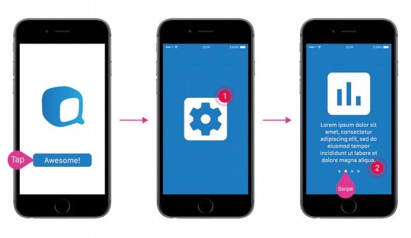

---

# Decoded
>Tech crash course by Bluqube

This nanocourse is divided into two sections. The skills you will learn here will accelerate your journey to becoming an app developer for Android.

## Design.me
> Learn how to implement Google's Material Design to your app.

### Section Contents
* App Prototyping
* Introduction to Material Design
  - App Layout
  - Material Design Components
  - Material Design Patterns

## Android on Fire
> Walkthrough on the different processes in developing your first Android App based on the design that you created.

### Section Contents
* Building your app natively using Java
  - Handling input from users
  - Managing screens
  - Data Handling
* Learning how to easily write and read almost any data to Firebase for Android.
* Using Google APIs.

---

## What's Next?
* App motion graphics – a geeky way to animate.
* Augmented Reality for Apps with Unity3D.
* Android and iOS Development with Facebook’s React Native framework.
